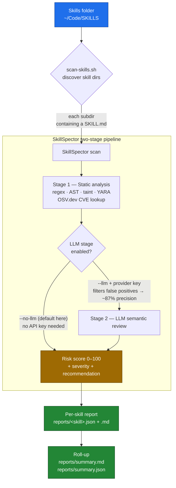
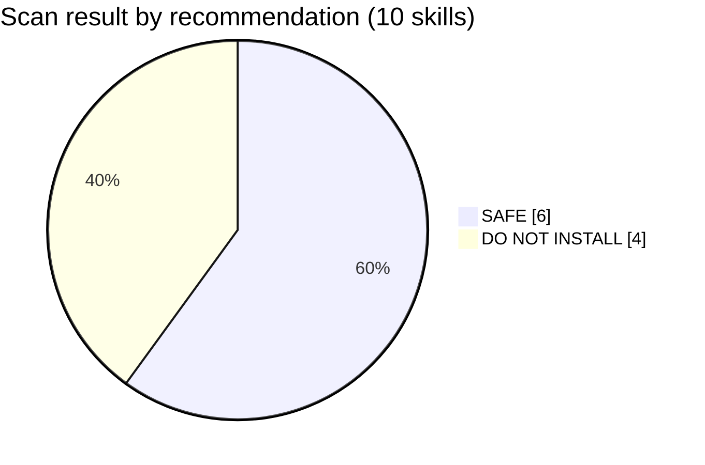
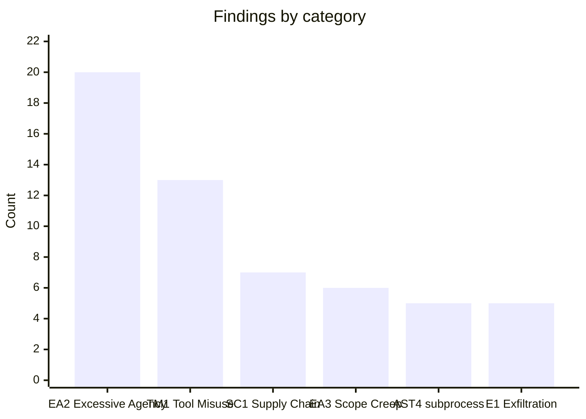

# SkillSpector Trial

A small wrapper project for trying out [**NVIDIA SkillSpector**](https://github.com/NVIDIA/SkillSpector)
against my own collection of Claude agent skills.

SkillSpector is a **security scanner for AI agent skills** — it answers *"is this
skill safe to install?"* by scanning `SKILL.md` files and their helper scripts for
prompt injection, data exfiltration, dangerous code, supply-chain risks, and more
(64 patterns across 16 categories). This project points it at every skill in my
skills folder and rolls the per-skill results up into a single summary.

## What this project is

```
skillspector-trial/
├── SkillSpector/        # vendored copy of NVIDIA/SkillSpector (Apache-2.0, see its LICENSE)
├── scripts/
│   ├── setup.sh         # one-time: create venv + install SkillSpector
│   └── scan-skills.sh   # scan every skill in a folder → reports/
├── reports/             # per-skill JSON + Markdown, plus summary.{json,md}
├── .gitignore
└── README.md
```

- **SkillSpector** is vendored at upstream commit
  [`1a7bf02`](https://github.com/NVIDIA/SkillSpector/commit/1a7bf026a3cf0ecfd957b6c173244d51b3141baf)
  (v2.1.3, 2026-06-10) — a flat copy with no nested `.git`, so the project is
  self-contained and clones cleanly. It is licensed separately under Apache-2.0
  (see [`SkillSpector/LICENSE`](SkillSpector/LICENSE)). To pull future pattern
  updates, re-vendor from that commit or convert `SkillSpector/` to a git submodule.

## How it works



## Where my skills were found

I keep skills in a few places, but the main collection is **`~/Code/SKILLS/`**
(other `SKILL.md` files also live under `~/Code/REPOS`, `~/Code/sw30`, and
`~/.claude/skills` — those weren't part of this run). The scanner treats each
immediate subdirectory containing a `SKILL.md` as one skill.

**10 skills scanned** from `~/Code/SKILLS` (static analysis only, no LLM):

| Skill | Score | Severity | Recommendation | Findings | Breakdown | Scripts |
|---|---:|---|---|---:|---|:---:|
| frontend-design-recommender | 100 | CRITICAL | DO NOT INSTALL | 13 | 5 H, 7 M, 1 L | yes |
| odc-2-artefact | 100 | CRITICAL | DO NOT INSTALL | 12 | 9 H, 1 M, 2 L | yes |
| odc-canvas | 100 | CRITICAL | DO NOT INSTALL | 38 | 6 H, 20 M, 12 L | yes |
| wiki-curator | 100 | CRITICAL | DO NOT INSTALL | 13 | 3 H, 9 M, 1 L | yes |
| create-graph-api | 13 | LOW | SAFE | 1 | 1 M | yes |
| manage-portfolio | 13 | LOW | SAFE | 1 | 1 M | yes |
| article-qa | 0 | LOW | SAFE | 0 | — | — |
| idea-buddy | 0 | LOW | SAFE | 0 | — | — |
| tab-newsletter | 0 | LOW | SAFE | 0 | — | yes |
| web-to-md-js | 0 | LOW | SAFE | 0 | — | — |

_Key: C=Critical, H=High, M=Medium, L=Low. Full table regenerated at_
[`reports/summary.md`](reports/summary.md).

### Result distribution



### Most common finding types (78 total)



## ⚠️ How to read these results

These are **my own skills**, so the four "CRITICAL / DO NOT INSTALL" verdicts are
**not** evidence of malware — they're what static analysis flags on real automation
skills. Worth understanding before trusting the score:

- **Static-only run.** I scanned with `--no-llm` (no API key required). SkillSpector
  itself notes static analysis has *"moderate precision (some false positives)"*; the
  optional LLM stage raises precision to ~87% by filtering them. Re-run with `--llm`
  for a sharper read (see below).
- **Bundled versions & zips inflate counts.** `odc-canvas` (38 findings) and
  `odc-2-artefact` bundle multiple versioned `.skill`/`.zip` copies, so the same
  pattern is counted once per copy.
- **The flags that actually merit a look:**
  - `SC4` in `frontend-design-recommender` — a dependency in `scripts/requirements.txt`
    with a **known CVE** (live OSV.dev lookup). This one is real and worth pinning/bumping.
  - `OH1` / `PE3` in `wiki-curator` — `scripts/detect_changes.py` uses model output
    without sanitization, and a patch file touches credential-file paths.
  - `TM1` (Tool Misuse) across odc-* — crafted tool params (e.g. `shell=True`, `--force`).
  - `MP3` (Memory Poisoning) / `P2` (Prompt Injection) hits are mostly inside
    **reference content** (design-prompt corpora, `.xlsx`), i.e. data the skill ships,
    not executable behavior — likely false positives, but skim them.

Bottom line: nothing here looks malicious, but `frontend-design-recommender`'s CVE'd
dependency and `wiki-curator`'s output handling are genuinely worth a fix.

## Re-running

```bash
# 1. One-time setup (creates SkillSpector/.venv, installs the tool)
scripts/setup.sh

# 2. Scan the default skills folder (~/Code/SKILLS), static only
scripts/scan-skills.sh

# Scan a different folder
scripts/scan-skills.sh ~/some/other/skills

# Enable the LLM semantic stage (better precision; needs a provider + key)
export SKILLSPECTOR_PROVIDER=anthropic
export ANTHROPIC_API_KEY=sk-ant-...
scripts/scan-skills.sh ~/Code/SKILLS --llm
```

Results land in [`reports/`](reports/): one `<skill>.json` and `<skill>.md` per skill,
plus `summary.json` and `summary.md`.

### Scan a single skill directly

```bash
cd SkillSpector
uv run --no-sync skillspector scan ~/Code/SKILLS/web2md --no-llm
```

## Notes / gotchas

- **Requires `uv`** (already installed here) and Python 3.12 (uv fetches it automatically).
- **Non-editable install on purpose.** `setup.sh` installs SkillSpector as a plain copy
  in the venv rather than editable. uv's editable install drops a bare-path `.pth` that
  uv's auto-sync intermittently reverts, which breaks `import skillspector` mid-batch.
  `scan-skills.sh` therefore calls `uv run --no-sync` so the venv is never re-linked
  during a run.
- **Exit codes are linter-style:** SkillSpector exits non-zero when a skill is high-risk.
  `scan-skills.sh` treats that as a normal result (a report was produced), not a failure.
- **LLM analysis costs API calls** and sends skill contents to your chosen provider —
  the default static-only mode stays fully local except for OSV.dev CVE lookups.
