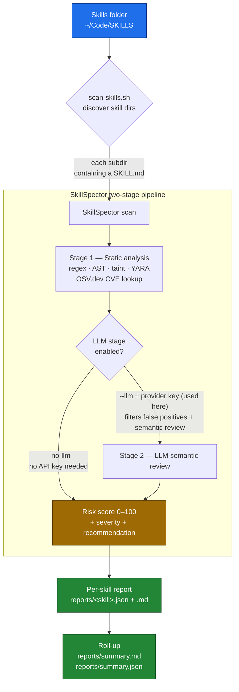

# SkillSpector Trial

A small wrapper project for trying out [**NVIDIA SkillSpector**](https://github.com/NVIDIA/SkillSpector)
against my own collection of Claude agent skills.

SkillSpector is a **security scanner for AI agent skills** — it answers *"is this
skill safe to install?"* by scanning `SKILL.md` files and their helper scripts for
prompt injection, data exfiltration, dangerous code, supply-chain risks, and more
(64 patterns across 16 categories). This project points it at every skill in my
skills folder and rolls the per-skill results up into a single summary.

## What this project is

```
skillspector-trial/
├── SkillSpector/        # vendored copy of NVIDIA/SkillSpector (Apache-2.0, see its LICENSE)
├── scripts/
│   ├── setup.sh         # one-time: create venv + install SkillSpector
│   └── scan-skills.sh   # scan every skill in a folder → reports/
├── reports/             # per-skill JSON + Markdown, plus summary.{json,md}
├── .gitignore
└── README.md
```

- **SkillSpector** is vendored at upstream commit
  [`1a7bf02`](https://github.com/NVIDIA/SkillSpector/commit/1a7bf026a3cf0ecfd957b6c173244d51b3141baf)
  (v2.1.3, 2026-06-10) — a flat copy with no nested `.git`, so the project is
  self-contained and clones cleanly. It is licensed separately under Apache-2.0
  (see [`SkillSpector/LICENSE`](SkillSpector/LICENSE)). To pull future pattern
  updates, re-vendor from that commit or convert `SkillSpector/` to a git submodule.

## How it works



## Where my skills were found

I keep skills in a few places, but the main collection is **`~/Code/SKILLS/`**
(other `SKILL.md` files also live under `~/Code/REPOS`, `~/Code/sw30`, and
`~/.claude/skills` — those weren't part of this run). The scanner treats each
immediate subdirectory containing a `SKILL.md` as one skill.

**Scan results** for `~/Code/SKILLS`, run with the LLM semantic stage enabled
(`--llm`). Full per-skill reports are in [`reports/`](reports/):

| Skill | Score | Severity | Recommendation | Findings | Breakdown | Scripts |
|---|---:|---|---|---:|---|:---:|
| manage-portfolio | 45 | MEDIUM | CAUTION | 3 | 1 H, 2 L | yes |
| create-graph-api | 13 | LOW | SAFE | 1 | 1 M | yes |
| web-to-md-js | 10 | LOW | SAFE | 1 | 1 M | — |
| article-qa | 5 | LOW | SAFE | 1 | 1 L | — |
| idea-buddy | 5 | LOW | SAFE | 1 | 1 L | — |

_Key: H=High, M=Medium, L=Low._

### Result distribution

Four skills scored **SAFE**; one — `manage-portfolio` — came back **CAUTION**
(MEDIUM) after the LLM rated a concern higher than static analysis did. Findings
are few and low-to-medium severity. These verdicts are the LLM-assisted ones (the
sharper read); see below for why that differs from a static-only pass.

## ⚠️ How to read these results

These are **my own skills**, so the verdicts are best read as a baseline, not a
clean bill of health. Worth understanding:

- **LLM-assisted run.** Scanned with `--llm`. The LLM stage filters static false
  positives and adds semantic review (see the next section). SkillSpector notes that
  static-only analysis has *"moderate precision (some false positives)"*; the LLM
  stage raises it.
- **`manage-portfolio` merits a glance.** The LLM rated it CAUTION — worth confirming
  the flagged behavior, though it is not clearly exploitable on its own.
- **Score ≠ malware.** A non-zero score reflects patterns treated as risk signals on
  real automation skills, not evidence of malicious behavior.

## What the LLM stage adds

Compared with a static-only pass, **the LLM stage does two things static analysis
can't**:

1. **Filters false positives on the noisy skills.** Static pattern-matching
   over-counts — bundled `.skill`/`.zip` copies and reference corpora each trip the
   same rule. The LLM reviews findings in context and drops the ones that aren't real.
   On one noisy skill the finding count fell from **38 → 11** once duplicates and
   non-executable reference content were filtered out.
2. **Finds real semantic issues static missed.** Regex and AST can't reason about
   *intent* or *behavior*. The LLM's developer-intent, quality-policy, and
   security-discovery analyzers surface genuine problems with no static signature.
   One skill that scored **SAFE / 0 findings** under static analysis came back
   **flagged** once the LLM read what it actually does — a **hardcoded SMTP password
   in plaintext**, a script that **sends email autonomously without a confirmation
   step**, a description-vs-behavior mismatch, and a prompt-injection in the skill text.

Net effect: the LLM run is both *quieter* (fewer false alarms) and *sharper* (catches
what patterns can't). Static-only is a fast first pass; the LLM stage is the one to
trust for a verdict.

## Re-running

```bash
# 1. One-time setup (creates SkillSpector/.venv, installs the tool)
scripts/setup.sh

# 2. Scan the default skills folder (~/Code/SKILLS), static only
scripts/scan-skills.sh

# Scan a different folder
scripts/scan-skills.sh ~/some/other/skills

# Enable the LLM semantic stage (better precision; needs a provider + key).

# Option A — local model via an OpenAI-compatible server (e.g. omlx / MLX).
# Fully local: no cloud, no API cost, nothing leaves the machine. This is the
# setup that produced the results above.
export SKILLSPECTOR_PROVIDER=openai
export OPENAI_BASE_URL=http://127.0.0.1:8000/v1                  # your local server
export OPENAI_API_KEY=test                                      # whatever the server expects
export SKILLSPECTOR_MODEL=Qwen3.6-35B-A3B-8bit-MTPLX-Optimized-Speed
scripts/scan-skills.sh ~/Code/SKILLS --llm

# Option B — a cloud provider (e.g. Anthropic):
export SKILLSPECTOR_PROVIDER=anthropic
export ANTHROPIC_API_KEY=sk-ant-...
scripts/scan-skills.sh ~/Code/SKILLS --llm
```

Results land in [`reports/`](reports/): one `<skill>.json` and `<skill>.md` per skill,
plus `summary.json` and `summary.md`.

### Scan a single skill directly

```bash
cd SkillSpector
uv run --no-sync skillspector scan ~/Code/SKILLS/web2md --no-llm
```

## Notes / gotchas

- **Requires `uv`** (already installed here) and Python 3.12 (uv fetches it automatically).
- **Non-editable install on purpose.** `setup.sh` installs SkillSpector as a plain copy
  in the venv rather than editable. uv's editable install drops a bare-path `.pth` that
  uv's auto-sync intermittently reverts, which breaks `import skillspector` mid-batch.
  `scan-skills.sh` therefore calls `uv run --no-sync` so the venv is never re-linked
  during a run.
- **Exit codes are linter-style:** SkillSpector exits non-zero when a skill is high-risk.
  `scan-skills.sh` treats that as a normal result (a report was produced), not a failure.
- **LLM analysis with a cloud provider** costs API calls and sends skill contents off
  the machine. The static-only mode stays fully local (except OSV.dev CVE lookups), and
  so does the LLM stage when pointed at a local server (Option A above).
- **Local-model adaptations.** Driving the LLM stage from a local OpenAI-compatible
  server needs a few tweaks in this vendored `SkillSpector/`: structured output via
  strict `json_schema` (which these servers enforce, unlike tool/function calling),
  Qwen "thinking" disabled via `chat_template_kwargs` so responses stay concise, and
  graceful fallback when a model returns malformed JSON. Set `SKILLSPECTOR_MODEL` to a
  model your server actually serves (see `model_registry.yaml` for token limits).
